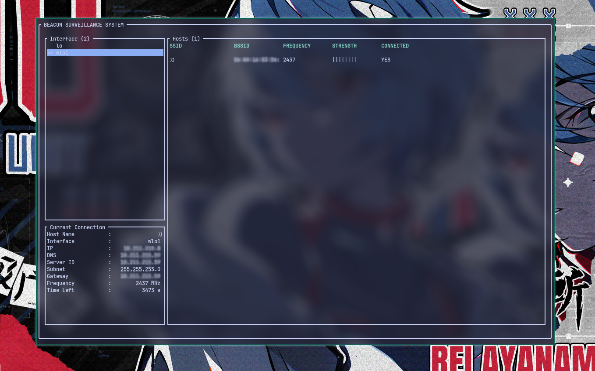

# Beacon



### A lightweight WiFi Manager

Beacon is a minimal alternative to `NetworkManager` written fully in Rust.
Status: Core functionality is stable. Work in Progress for Upcoming features.

## Architecture

This Project uses Daemon - Client Architecture meaning a daemon(`beacond`) will be running in the background while user can communicate with the daemon using the tui(`beacon`).

## Features

- Automatic Connection if once already connected
- Periodic WiFi Scan with Auto-Connection.
- Ethernet Support.
- Multiple Interface Control (Wireless)
- Daemon-Client separation i.e Users do not lose state on client crash.

## Prerequisites

- `wpa_supplicant` needs to be installed

## Installation

### Void Linux

```sh
# Installing the binaries
sudo xbps-install beacon

# linking with Runit to run on startup
sudo ln -s /etc/sv/beacon/ /var/service/
```

### Install from source

```sh
cargo build --release
sudo ./install.sh
```

**Note:** The install script only works for systems running systemd or runit

## How to Run

### Start the Daemon

**Note:** If you do not have `systemd` or `runit`, run daemon in background manually with

```sh
# -b flag for running in background
sudo beacond -b

```

### Start the Client

```sh
sudo beacon
```

## Crates Used

<details>
<summary>Dependencies</summary>

| Crate                  | Purpose                                    |
| ---------------------- | ------------------------------------------ |
| `dhcp4r`               | DHCP packet structures and message parsing |
| `nl80211`              | nl80211 enums for kernel Wi-Fi subsystem   |
| `neli`                 | Raw Netlink command creation               |
| `socket2`              | Raw socket creation                        |
| `etherparse`           | Ethernet packet parsing and creation       |
| `ratatui`              | Terminal UI rendering                      |
| `tokio`                | Async runtime                              |
| `serde` + `serde_json` | Serialization and deserialization          |
| `bincode`              | Binary serialization for IPC               |
| `rand`                 | Random token generation                    |
| `chrono`               | Timestamps and time tracking               |

</details>

## License

MIT — see [LICENSE](LICENSE) for details.

That's it!
